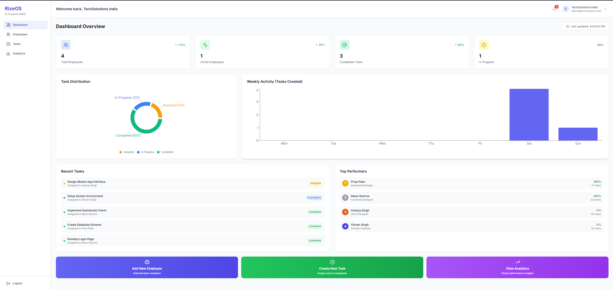
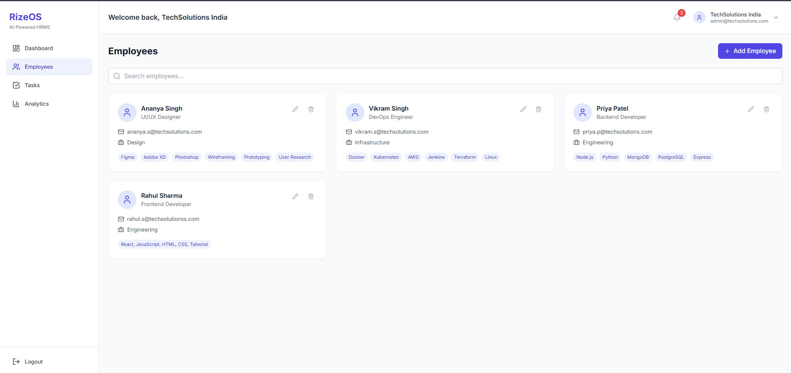
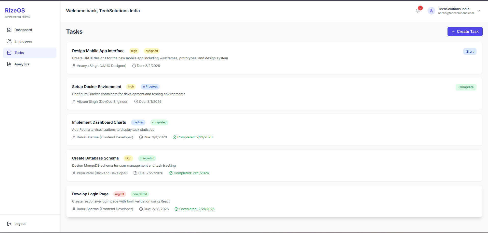
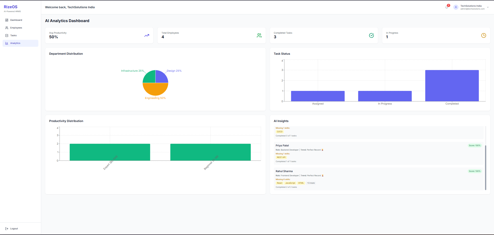
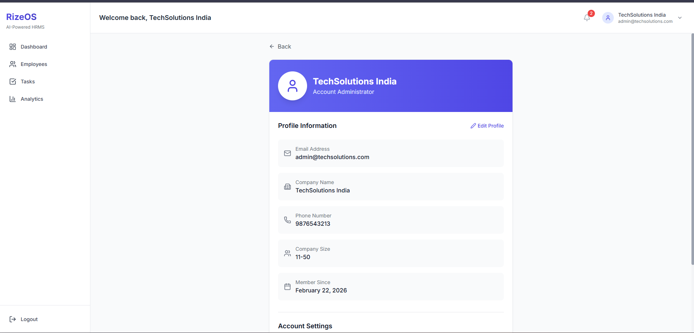
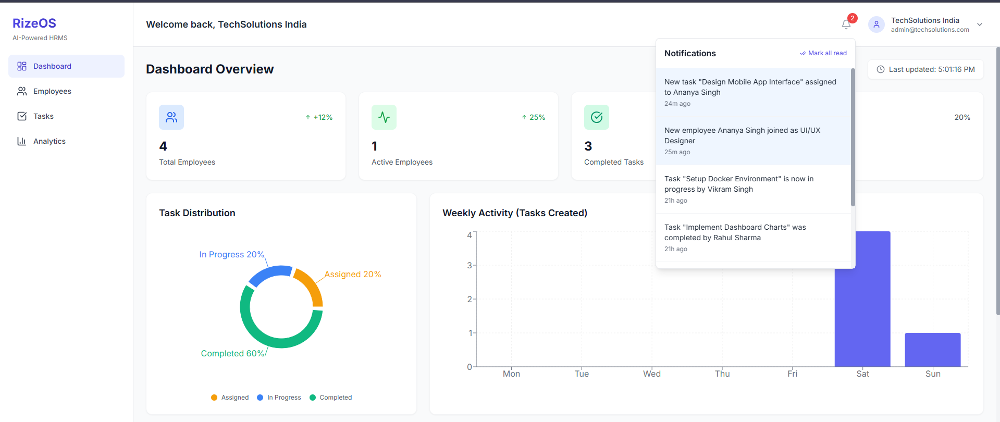

# 🚀 RizeOS - AI-Powered HRMS

<div align="center">
  
  <p><em>AI-Powered Human Resource Management System</em></p>
</div>

## 📋 Overview

RizeOS is a next-generation HRMS platform that combines **AI-powered workforce intelligence** with modern task management. Built for the RizeOS Core Team Internship assessment, this application demonstrates full-stack development capabilities with React, Node.js, MongoDB, and AI integration.

### ✨ Key Features

| Feature | Description |
|---------|-------------|
| **🤖 AI Workforce Intelligence** | Productivity scoring, skill gap detection, performance prediction |
| **👥 Employee Management** | Complete CRUD operations with role-based access |
| **📋 Task Management** | Assign, track, and update tasks with priority levels |
| **📊 Analytics Dashboard** | Real-time charts and productivity metrics |
| **🔔 Notifications** | Real-time alerts for task and employee events |
| **👤 User Profile** | Customizable profile with company details |
| **🔗 Web3 Ready** | Wallet address integration (MetaMask ready) |

---

## 🛠️ Tech Stack

### Frontend
- **React 18** - UI Library
- **Tailwind CSS** - Styling
- **Recharts** - Data visualization
- **Lucide React** - Icons
- **Axios** - HTTP client
- **React Router DOM** - Navigation

### Backend
- **Node.js** - Runtime environment
- **Express** - Web framework
- **MongoDB** - Database
- **Mongoose** - ODM
- **JWT** - Authentication
- **bcryptjs** - Password hashing

### DevOps
- **Render** - Backend hosting
- **Vercel** - Frontend hosting
- **GitHub** - Version control

---

## 📸 Screenshots

<div align="center">
  <h3>Dashboard Overview</h3>
  
  <p><em>Real-time productivity metrics and task distribution</em></p>
  
  <h3>Employee Management</h3>
  
  <p><em>Manage employees with skill tracking</em></p>
  
  <h3>Task Management</h3>
  
  <p><em>Create and track tasks with priority levels</em></p>
  
  <h3>AI Analytics</h3>
  
  <p><em>AI-powered insights and skill gap detection</em></p>
  
  <h3>Profile Page</h3>
  
  <p><em>User profile with company details</em></p>
  
  <h3>Notifications</h3>
  
  <p><em>Real-time alerts for task and employee events</em></p>
</div>

---

## 🚀 Live Demo

| Service | URL |
|---------|-----|
| **Frontend** | [https://rizeos-hrms.vercel.app](https://rizeos-hrms.vercel.app) |
| **Backend API** | [https://rizeos-api.onrender.com](https://rizeos-api.onrender.com) |

### Test Credentials
Email: admin@techsolutions.com
Password: Password123!


---

## 💻 Installation & Setup

### Prerequisites
- Node.js (v14 or higher)
- MongoDB Atlas account
- npm or yarn

### Clone Repository
```bash
git clone https://github.com/dk9480/rizeos-hrms.git
cd rizeos-hrms

```

## 🚀 Setup & Installation Guide

Follow the steps below to run the project locally.

---

## 🔧 Backend Setup

```bash
cd server
npm install
```

### 🔧 Backend Environment Setup

Create a `.env` file inside the `server` directory:

```env
PORT=5000
MONGODB_URI=your_mongodb_connection_string
JWT_SECRET=your_jwt_secret
NODE_ENV=development
```

### ▶ Start Backend Server

```bash
npm run dev
```

### 🎨 Frontend Setup

```bash
cd client
npm install
npm start
```
The app will open at:
http://localhost:3000
```

## 📁 Project Structure

rizeos-hrms/
├── server/
│   ├── models/
│   │   ├── User.js
│   │   ├── Employee.js
│   │   ├── Task.js
│   │   └── Notification.js
│   ├── routes/
│   │   ├── auth.js
│   │   ├── employees.js
│   │   ├── tasks.js
│   │   ├── dashboard.js
│   │   ├── notifications.js
│   │   └── users.js
│   ├── middleware/
│   │   └── auth.js
│   ├── .env
│   └── server.js
│
├── client/
│   ├── public/
│   ├── src/
│   │   ├── components/
│   │   ├── pages/
│   │   ├── context/
│   │   ├── utils/
│   │   ├── services/
│   │   ├── App.js
│   │   └── index.js
│   └── package.json
│
├── screenshots/
│   ├── dashboard.png
│   ├── employees.png
│   ├── tasks.png
│   ├── analytics.png
│   ├── profile.png
│   └── notifications.png
│
├── README.md
└── package.json
